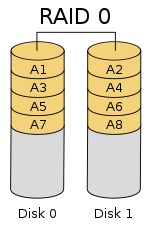
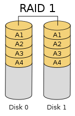
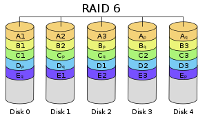
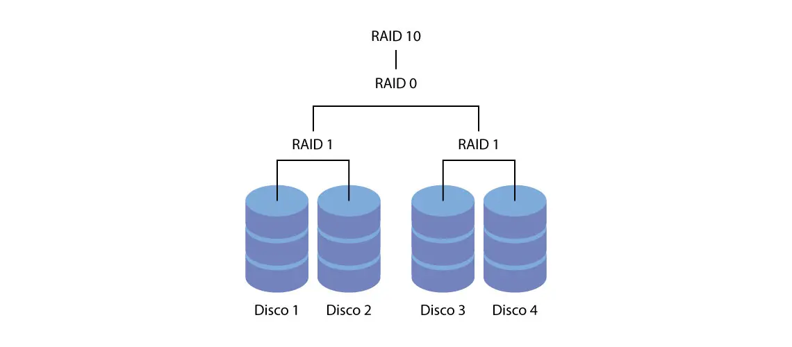
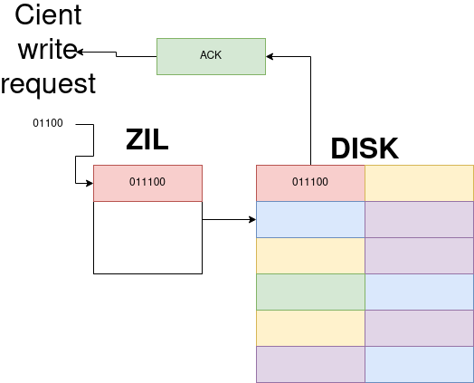

# ROADMAP
- [x] RAID{0,1,6,10}
- [x] ZFS description and capabilities
- [x] RAID implementations in ZFS
- [x] Cache systems in ZFS

# RAIDs
### **R**edundant **A**rray of **I**ndependent **D**isks

## Some recorrent terms when defining a RAID system:
**PARITY** 
:   Refers to *parity bit*, it's a bit added to a string that says if the sum of bits in the string is even/odd, it's a simple form of error checking. Commonly the parity bit is added in the end of each byte (8 bits).

**DATA STRIPING**
:   The concept of dividing each data array into various segments so the data can be more easily manipulated and stored

**MIRROR**
:   Replicates *logical disk* volumes into multiple physical disks, so the same information is stored in different hard disks in real time
    
## RAID0

RAID0 splits data across a multiple-disks array. The ideal setup is equaly-sized disks since the total storage used in a RAID0 arrangement is equal to the lower storage disk space times the total amount of disks. I a array of one 120Gb disk and one 360Gb disk, the total storage available would be 240 Gb.

RAID0 create stripes of data so disk operations are n-times faster, n being the total amount of disks available. It also distributes I/O costs between all disks making it a very fast storage system. RAID0 **doesn't implements parity** or even any **fault tolerance**, so the failure of one single disk in the array will result in total data loss. 

Besides fastness, RAID0 also is a good system to create large amounts of data storage units with lesser disks, since all disks in the array have unique information and, having equaly-sized units, uses 100% it's physical capability as storage.

## RAID1

RAID1 mirrors sets of data on **two or more** physical disks at a time. This RAID setting, as in RAID0, also doesn't offer any *parity* and the setup replicates the size of the smallest disk on all the other disks as well. In RAID1 theres no data striping since all data is replicated multiple times.

RAID1 read operations can be taken by any of the disks in the array, it's useful on read performance and reliability on data, but it is bad on write performance and total data storage capacity. 

## RAID6

RAID6 uses *double parity* striped all over the array so it's allways possible to have two failed disks without losing any information. It needs to calculate 2 different systems to make paritys p and q and store them in distinct units, because of this, RAID6 has a overhead cost on write operations that is the double of a single-parity implementation as in RAID5. RAID5 doesn't have read operations performance penaltys.

RAID6 is a very good system to use when reliability and disponibility of data is more needed than performance.

## RAID10

RAID10 is a simuntaneous implementation of RAID0 and RAID1, combining the performance boost of RAID0 with the reliability of data present in RAID1. RAID10 needs at least two 'tanks' of disks arranged in RAID1 configuration, replicating all data in all disks of each tank. Than it takes these tanks and arrange then in a RAID0 setup, so all data is striped and writen segmented in each tank.

RAID10 offers a boost in read and write operations performance, at the same time that it permits at least 1 disk of each tank failing at once without any data loss. This systems does this by using double of logical storage in physical storage, so it'll always use half of total raw disks capacity.

It's a good system when total storage isn't more requested than performance and relaibility.

___

# ZFS
### **Z**ettabyte **F**ile **S**ystem

Usually, data management involves physical and logical aspects. The first being the raw HardDrives and SDs organized in blocks and the second being the logical block devices as seen by the operation system. The logical part can use multiple layers as volume managers and RAID controllers.

ZFS acts both as a physical storage manager and a logical data manager, so it knows about all physical volumes available in the system and all the firmware and software that turns them in a useful unit to the operation system.This way, ZFS garantees that errors commited by the OS or even by the hardware can possibly be fixed in any step of the data management path.

As described in the documentation, one of the most powerful capabilities of ZFS is **snapshots** and replication of them. With this FileSytem, it's possible to take a snapshot of the entire system before any risky software changes or system operations, this way, it's always possible to **rollback** to a *checkpoint* if any operation has caused instabilities in the entire system. 

With the snapshot option, it's also possible to replicate a entire and independet file system. And it's implementation lets several numbers of snapshots to be taken without losing performance.

## RAIDs with ZFS
ZFS implements versions of RAID0, RAID1 and RAID6. The first and second one are called as their most known names: RAID0 and RAID1. For parity-type RAIDS as RAID5 and RAID6, ZFS calls them as RAIDZ-{1,2,3}, the number being the total amount of parity disks available in the physical blocks.

As known in RAID10 implementation, ZFS can take two or more RAID1 tank arrangements to make a RAID0 array, resulting in a RAID10 setup. This setup needs at least four total disks

It's important to know that a RAID0 and RAID1 requires at least two disks, and any RAID-Z requires at least n+2 disks, n being the total amount of parity disks available in the system.

## Cache in ZFS
### Read caching:
ARC (**A**daptive **R**placement **C**ache) - Simple RAM cache, hot data blocks are stored in memory for faster acces, ZFS tries to fill all RAM disponible at max, if max level is achieved, oldest blocks gets flushed from memory and needs to be taken in the disk if a read operation requires then again.

L2ARC (**L**evel **2** **ARC**) - Adds SSDs in cache flow so oldest data removed from RAM gets on a device faster than hard drives.

### Write caching:
By default, ZFS stores all write requests in RAM as Transaction Groups (**TXGs**) and foward them to the disk in a setted time interval (5 seconds as default). This benefits performance as all disk writes are somewhat organized and is easier to disks to process them. In a power failure event, this system also avoid data inconsistency as no parcial writes will be executed, instead, all data in TXG will be flushed as it is stored in a volatile data device.

The two types of writes in ZFS are:

#### Asynchronous:

- Data immediately cached in RAM and seen as completed by client, then written to disk;
- If a power failure occurs, all data in TXGs is lost, so it's very fast but no so consistent.

#### Synchronous:

- Data still goes to RAM first, but client just see acknowledge if data has been written to persistent storage media. It's slower on client side.
- There is a part o ZFS pool called ZFS Intent Log (**ZIL**), this blocks stores all write transactions initiations and receive the acknowledge of completion to forward to the client. This way, if a write fails, there is a persistent memory block logging that some data was not written and prevents data loss
- ZIL is reliable if implemented in a faster memory device, as an SSD, usually on a separate device.

